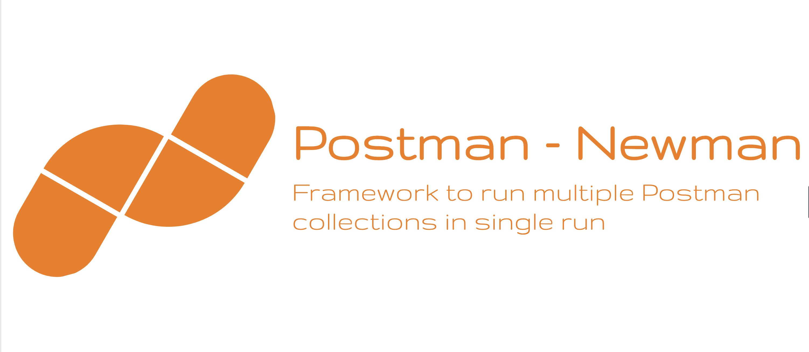

# Postman - Newman Framework

A framework to run multiple postman collections in single run by leveraging newman library.

[](LICENSE)
[](https://www.ruby-lang.org/en/)
[]( https://stackoverflow.com/users/10505289/naresh-sekar )
[](CONTRIBUTING.md)
[](mailto:nareshnavinash@gmail.com)





## Prevailing Problem

If we need to run multiple postman collections or single postman collections with multiple environments, then it becomes we need to have multiple command lines as,

```
newman run <file1.json>
newman run <file2.json> -e <env1.json>
newman run <file2.json> -e <env2.json>
...
```

Also, if we need to have multiple reports along with this run, we need to specify those each of these command line run along with the folder in which the reports should be generated as,

```
newman run <file1.json> --reporters cli,html,allure --reporter-html-export htmlOutput.html --reporter-allure-export <allure-results-out-dir>
newman run <file2.json> -e <env1.json> --reporters cli,html,allure --reporter-html-export htmlOutput.html --reporter-allure-export <allure-results-out-dir>
newman run <file2.json> -e <env2.json> --reporters cli,html,allure --reporter-html-export htmlOutput.html --reporter-allure-export <allure-results-out-dir>

```

So, as we can see the params that we are passing in the commandline keeps on increasing and its much difficult to consolidate and have a single report for multiple newman run. In Python or in Ruby test runs we have profiles that we can specify during a run which will have most of the static commandline params.


## Aim

This framework is aimed at resolving the above particular issue along with allure reports integration which can be easily integrated with jenkins. 


## Supports
* Multiple collections run in single shot
* Allure reports along with newman's default CLI, HTML & JSON
* Jenkins Integration
* Docker Execution


## Pending
* Need to handle tests with iteration data.


## Setup
* Clone this repository
* Navigate to the cloned folder
* Install node and npm using `brew install node`
* Install the dependencies with respect to this project by `npm install`


## To Run the tests

To make the command line run options easier, added common run options as scripts in `package.json` file.

For a simple run of all the feature files in normal mode without any video recording, try
```
npm run test -- <Feed_file_which_contains_input_collections>
```


## Allure
To open the allure results,
```
npm run serve-allure
```
Along with allure reports, newman's default CLI, HTML and JSON reports are added which can be found at `reports/` path. For sophesticated classification, reports for each collection is isolated with different name. If needed JSON and HTML files can be pushed to S3 for further processing or to have a record.

To clear the all the report files from results directory,
```
npm run clean-report
```

## Jenkins Integration with Docker images
Get any of the linux with cypress docker image as the slaves in jenkins and use the same for executing the UI automation with this framework (Sample docker image - `https://hub.docker.com/r/postman/newman/`). From the jenkins bash Execute the following to get the testcases to run,
```
#!/bin/bash -l
npm list
ls
cd <path_to_the_project>
npm install
npm run test -- <feed_file> <or custom run option>
```

In Jenkins pipeline, try to add the following snippet to execute the tests,
```
pipeline {
    agent { docker { image 'postman/newman' } }
    stages {
        stage('build') {
            steps {
                sh 'cd project/'
                sh 'npm install'
                sh 'npm run test -- <feed_file>' # or custom methods
            }
        }
    }
}
```

## Breakdown in to testcases

### Feed files

The feed file is the core structure for this framework to function. In the feed file, one has to specify the collections and environment json files path or the url in the array format inside `runs` variable like,

```
{
    "runs":[
        {
            "collection": "./collections/test_scripts.postman_collection.json"
        },
        {
            "collection": "./collections/file_upload_collection.postman_collection.json",
            "environment": "./environment/test_environment.json"
        }
        
    ]
}
```

If we have only collections that need to be run as part of the test, then have `collection` alone. If we have collection and environment files, then we need to specify both `collection` and `environment` in json format.

When we initiate the tests, the `runs` array will be iterated and all the tests will be run using `newman` package. 

Ideally we should have the postman collection link as the feed file input, this gives us the leverage of modifying the tests via postman without touching the core framework. The ideal feed file will be,

```
{
    "runs":[
        {
            "collection": "https://www.getpostman.com/collections/57c3cfef239jeijw39d93"
        },
        {
            "collection": "https://www.getpostman.com/collections/57c3cfef239jeijwew282",
            "environment": "./environment/test_environment.json"
        }
        
    ]
}
```

Once the feed file is prepared, one can directly trigger the test by,

```
npm run test -- <Feed_file_which_contains_input_collections>
```

### Folder structure

If we need to have the 


## Built With

* [Newman](https://www.npmjs.com/package/newman) - Automation core framework to run Postman collections.
* [Newman-Allure](https://www.npmjs.com/package/newman-reporter-allure) - For Detailed reporting.

## Contributing

1. Clone the repo!
2. Create your feature branch: `git checkout -b my-new-feature`
3. Commit your changes: `git commit -am 'Add some feature'`
4. Push to the branch: `git push origin my-new-feature`
5. Create a pull request.

Please read [CONTRIBUTING.md](CONTRIBUTING.md) for details on code of conduct, and the process for submitting pull requests.

## Authors

* **[Naresh Sekar](https://github.com/nareshnavinash)**

## License

This project is licensed under the GNU GPL-3.0 License - see the [LICENSE](LICENSE) file for details

## Acknowledgments

* To all the open source contributors whose code has been referred in this project.
